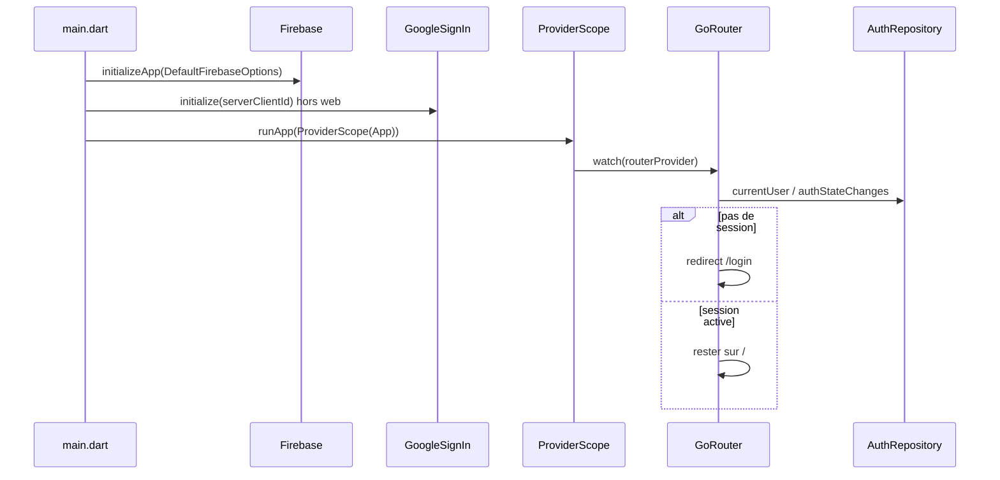

# Architecture actuelle

SafeVault (package `flutter_pwd_container`) est un coffre de mots de passe. **Aujourd’hui**, seule la **session** existe : se connecter avec Google, rester connecté, accéder à une page d’accueil vide.

Les secrets du coffre ne sont pas encore stockés. Riverpod prépare le terrain : les écrans liront plus tard un repository chiffré de la même façon qu’ils lisent déjà l’auth.

## Flux de démarrage



## Arborescence utile

| Fichier | Rôle |
| --- | --- |
| [`lib/main.dart`](../lib/main.dart) | Bootstrap unique : bindings Flutter, Firebase, Google Sign-In, `ProviderScope` |
| [`lib/firebase_options.dart`](../lib/firebase_options.dart) | Clés client générées par FlutterFire (projet `flutter-pwd-container`) |
| [`lib/src/app.dart`](../lib/src/app.dart) | `MaterialApp.router` + thème, sans logique métier |
| [`lib/src/theme/app_theme.dart`](../lib/src/theme/app_theme.dart) | Couleurs SafeVault (fond sombre, cyan) |
| [`lib/src/services/auth_service.dart`](../lib/src/services/auth_service.dart) | `AuthRepository` : appels Firebase / Google, testable |
| [`lib/src/providers/auth_providers.dart`](../lib/src/providers/auth_providers.dart) | Exposition Riverpod du repository et du stream de session |
| [`lib/src/router/app_router.dart`](../lib/src/router/app_router.dart) | Routes, garde d’auth, `routerProvider` |
| [`lib/src/views/login_view.dart`](../lib/src/views/login_view.dart) | Écran Google Sign-In |
| [`lib/src/views/home_view.dart`](../lib/src/views/home_view.dart) | Page vide post-login + déconnexion |
| [`android/app/google-services.json`](../android/app/google-services.json) | Config native Android (plugin Google Services) |

## Couches

```
Vues (LoginView, HomeView)
        ↓ ref.read / ref.watch
Providers Riverpod (session, plus tard coffre)
        ↓
Repositories (AuthRepository, plus tard VaultRepository)
        ↓
SDK (Firebase Auth, Google Sign-In, plus tard stockage chiffré)
```

Les vues ne parlent pas à Firebase directement. Ça permet de tester un écran sans Firebase, et de changer d’implémentation (ex. fake auth en test) sans retoucher l’UI.

## Ce qui ne vit pas dans les widgets

- L’initialisation Firebase : une seule fois dans `main()`, avant le premier frame.
- La décision « login ou coffre » : dans `GoRouter.redirect`, pas dans un `if` au milieu de `LoginView`.
- L’état de session : dans `authStateChanges()`, pas dans un `bool _loggedIn` local.
