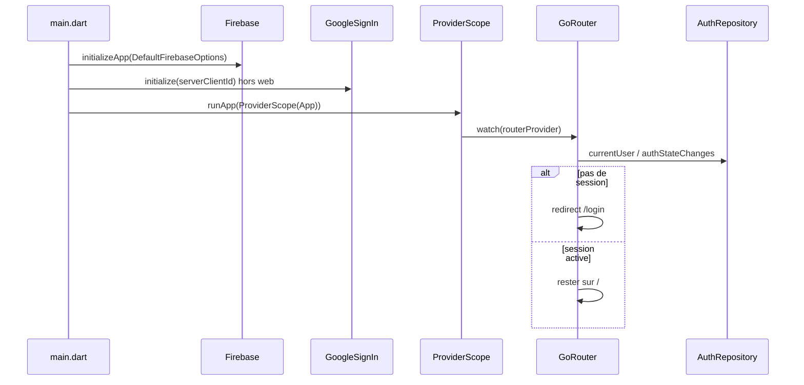

# Architecture actuelle

SafeVault (package `flutter_pwd_container`) est un coffre de mots de passe. **Aujourd’hui** : session Google + coffre chiffré local (données seulement, pas encore d’écran de liste).

## Flux de démarrage



## Arborescence utile

| Fichier | Rôle |
| --- | --- |
| [`lib/main.dart`](../lib/main.dart) | Bootstrap unique : bindings Flutter, Firebase, Google Sign-In, `ProviderScope` |
| [`lib/firebase_options.dart`](../lib/firebase_options.dart) | Clés client générées par FlutterFire (projet `flutter-pwd-container`) |
| [`lib/src/app.dart`](../lib/src/app.dart) | `MaterialApp.router` + thème, sans logique métier |
| [`lib/src/theme/app_theme.dart`](../lib/src/theme/app_theme.dart) | Couleurs SafeVault (fond sombre, cyan) |
| [`lib/src/services/auth_service.dart`](../lib/src/services/auth_service.dart) | `AuthRepository` : appels Firebase / Google, testable |
| [`lib/src/providers/auth_providers.dart`](../lib/src/providers/auth_providers.dart) | Exposition Riverpod du repository et du stream de session |
| [`lib/src/router/app_router.dart`](../lib/src/router/app_router.dart) | Routes, garde d’auth, `routerProvider` |
| [`lib/src/views/login_view.dart`](../lib/src/views/login_view.dart) | Écran Google Sign-In |
| [`lib/src/views/home_view.dart`](../lib/src/views/home_view.dart) | Page vide post-login + déconnexion |
| [`lib/src/models/vault_entry.dart`](../lib/src/models/vault_entry.dart) | Fiche du coffre (clair en mémoire seulement) |
| [`lib/src/services/vault_cipher.dart`](../lib/src/services/vault_cipher.dart) | AES-256-GCM |
| [`lib/src/services/vault_storage.dart`](../lib/src/services/vault_storage.dart) | Keystore + fichier `.enc` (ou mémoire en test) |
| [`lib/src/services/vault_repository.dart`](../lib/src/services/vault_repository.dart) | load / upsert / delete par `uid` |
| [`lib/src/providers/vault_providers.dart`](../lib/src/providers/vault_providers.dart) | `vaultEntriesProvider` |
| [`android/app/google-services.json`](../android/app/google-services.json) | Config native Android (plugin Google Services) |

## Couches

```
Vues (LoginView, HomeView)
        ↓ ref.read / ref.watch
Providers Riverpod (session, coffre)
        ↓
Repositories (AuthRepository, VaultRepository)
        ↓
SDK (Firebase Auth, Google Sign-In, Secure Storage, fichier chiffré)
```

Les vues ne parlent pas à Firebase directement. Ça permet de tester un écran sans Firebase, et de changer d’implémentation (ex. fake auth en test) sans retoucher l’UI.

## Ce qui ne vit pas dans les widgets

- L’initialisation Firebase : une seule fois dans `main()`, avant le premier frame.
- La décision « login ou coffre » : dans `GoRouter.redirect`, pas dans un `if` au milieu de `LoginView`.
- L’état de session : dans `authStateChanges()`, pas dans un `bool _loggedIn` local.
- Les secrets au repos : fichier AES-GCM + clé Keystore, jamais un JSON en clair.
