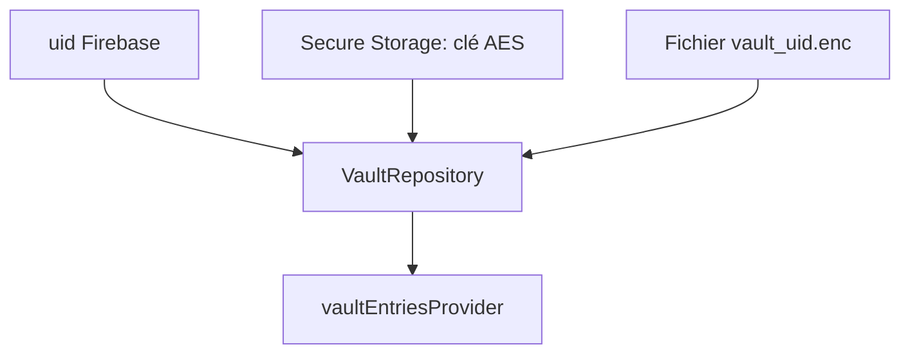

# Coffre chiffré (données)

Étape actuelle : le coffre existe **en données**, pas encore d’écran de liste. Les widgets n’appellent pas Firebase pour les secrets.

## Ce qui est stocké

Une fiche [`VaultEntry`](../lib/src/models/vault_entry.dart) :

- `id` (UUID)
- `serviceName`, `url` optionnelle, `username`
- `password` (clair **uniquement en mémoire** après déchiffrement)
- `createdAt` / `updatedAt` (UTC)

Sur disque, ce JSON n’apparaît jamais en clair. Il est chiffré en **AES-256-GCM** (nonce aléatoire + MAC). Le fichier `vault_<uid>.enc` contient `nonce || ciphertext || mac`.

## Où sont les clés

La clé AES (256 bits) vit dans **Flutter Secure Storage** (Keystore / Keychain), une clé **par** `uid` Firebase : `vault_aes_key_<uid>`.

Le blob chiffré vit dans le répertoire support de l’app (`path_provider`), pas dans Firebase.

Changer de compte Google charge un autre fichier et une autre clé. Pas de mélange entre utilisateurs.

## Providers

Dans [`lib/src/providers/vault_providers.dart`](../lib/src/providers/vault_providers.dart) :

| Provider | Rôle |
| --- | --- |
| `secureKeyStoreProvider` | Keystore ; overridable en test (mémoire) |
| `encryptedBlobStoreProvider` | Fichier `.enc` |
| `vaultRepositoryProvider` | load / upsert / delete |
| `vaultEntriesProvider` | `AsyncNotifier` : liste déchiffrée, se vide si logout |

`build()` du notifier **watch** `authStateProvider` : login → charge le coffre ; logout → `[]`.

Les mutations (`upsert`, `delete`) exigent un `currentUser`. Pas d’UI pour l’instant : l’étape suivante branchera la liste dessus.

## Pourquoi pas tout dans Riverpod

Riverpod garde la liste en RAM **après** déchiffrement, pour l’UI. Il ne remplace pas le fichier chiffré. Couper l’app oublie la RAM ; le Keystore + `.enc` restent.

Les tests du repository n’utilisent pas les plugins : `MemorySecureKeyStore` + `MemoryEncryptedBlobStore`.
